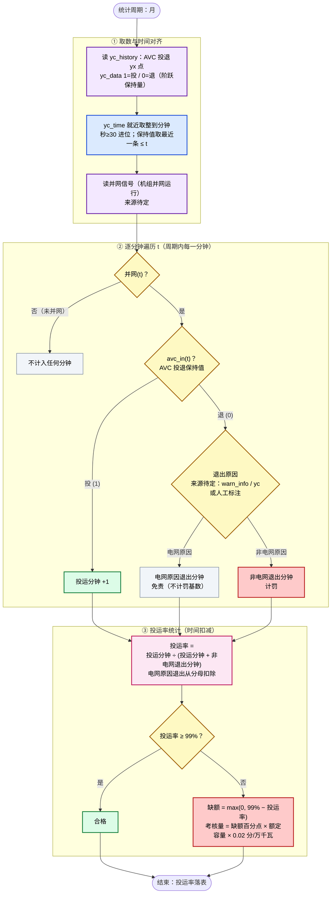
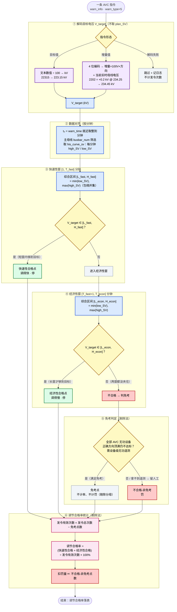

# VQMS AVC 考核核心算法 —— 流程图（基于 AVC考核核心算法_草稿.md）

> 配套 [AVC考核核心算法_草稿.md](../AVC考核核心算法_草稿.md)。两个考核维度（附件6 §一 投运率、§二 调节合格率）各自独立成图。
>
> ⚠️ 与旧的「电压合格率四道关」流程图（[v3.4 通俗版](backup/核心算法流程图_v3_4_通俗版.md)）**不是同一模型**：旧图讲每分钟实际电压 vs 目标窄区间；本图讲 **AVC 装置投运率（时间记账）** 和 **AVC 指令调节合格率（分档 + 免考）**。判定字段统一为 `high_SV`/`low_SV`（`average_SV`/`plan_SV` 不参与）；目标电压来自 `warn_info`（不取 `plan_SV`）。
>
> 📌 图中所有标「**来源待定**」「**待定**」之处均照录草稿未决项，未作虚构。

---

## 图 A：AVC 投运率算法（时间记账）

> 投运率考核 AVC 装置在不在线。**不适用 §三 免考**（免考仅作用于调节合格率）；它自己的免责是「扣除电网原因退出时间」。

---

## 图 B：调节合格率算法（分档判定 + 状态机 + 免考）

> 考核 AVC 指令下达后是否在窗口内把电压调到目标。分两档（快速性 / 经济性），先到先归类；两窗都未夹住再判免考（剔除法）。

---

## 颜色含义

紫 = 取数 / 解码 · 蓝 = 对齐 / 综合 · 黄 = 判定关 · 绿 = 合格 · 红 = 不合格 / 罚 · 灰 = 不计 / 剔除 / 跳过 · 粉 = 汇总输出。

## 一句话总结

- **投运率**：逐分钟看「并网了没」「AVC 投着没」，投着就记投运分钟，退了按原因分流——电网原因免责扣除、非电网计罚，最后 投运分钟 ÷ (投运 + 非电网退出) 是否够 99%。
- **调节合格率**：一条指令解码出目标电压 → 先看短窗（快速性）包络夹不夹得住目标 → 夹不住再看长窗（经济性）→ 都夹不住判免考，满足免考就剔除去分母，否则计罚。

## 图中保留的待定项（照录草稿，未决）

- **退出原因来源**（图 A ②）：`warn_info` / `yc_history` 是否有 AVC 退出原因点位，待确认；若无则人工标注。
- **并网信号来源**（图 A ①）：机组并网信号 / 合并方式待定。
- **`T_econ` 上限**（图 B ④）：「≥5 min」需定上限（如 30 min），否则长越限永远在经济性窗内算合格。
- **窗口内缺数据**（图 B ③④）：某分钟无 `his_curve_sv` 记录——草稿暂定跳过（不计 min/max）+ 日志，整窗全缺则该指令剔除。
- **增量解码位定义**（图 B ①）：4 位编码第 2 位「循环码」含义待真实数据验证。
- **免考遥测可得性**（图 B ⑤）：设备级无功遥测若拿不到，免考留人工。

> 详见草稿 §1.4 / §2.8。
