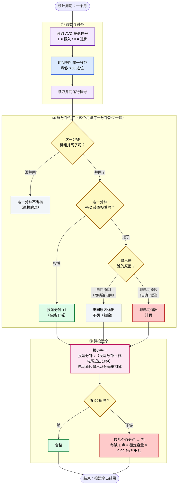
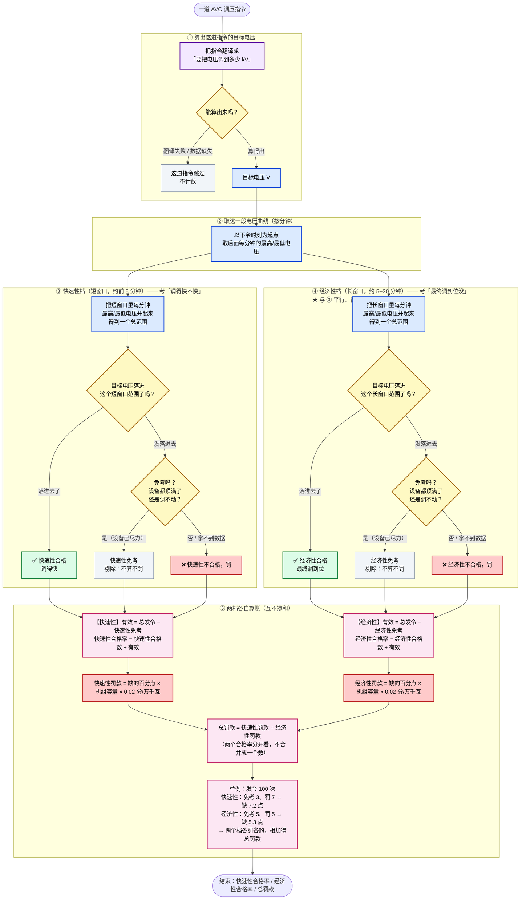

# VQMS AVC 考核核心算法 —— 流程图 v4.0（通俗版 · 给非开发同事看）

> 这张图用大白话讲两件事：**AVC 装置投运率**（它在不在线）和 **调节合格率**（下达指令后调到目标没）。
>
> ⚠️ **先分清**：这里有两个独立考核维度，不是同一个数。
> - **投运率**：考时间——AVC 装置这个月有没有在线干活，够不够 99%。
> - **调节合格率**：考动作——调度下一道调压指令，AVC 有没有在规定时间内把电压调到位。
>
> 📌 与旧的「电压合格率四道关」流程图（[v3.4 通俗版](backup/核心算法流程图_v3_4_通俗版.md)）不是同一套口径。旧图讲每分钟实际电压 vs 目标窄区间；本图讲 AVC 装置投运率 + 指令调节合格率（附件6 §一、§二）。

---

## 图 A：AVC 投运率是怎么算出来的（时间记账）

> 一句话：这个月里，只要机组并网着、AVC 装置也投着，就记「投运」；退了就记「退出」。退出分两种——电网原因导致的退出**不罚**（扣除），非电网原因的退出**计罚**。最后看投运时间够不够 99%。

---

## 图 B：调节合格率是怎么算出来的（两档平行 + 免考）

> 一句话：调度下一道调压指令，解码出「目标电压」→ **快速性档**（短窗口）和**经济性档**（长窗口）**同时、各自独立**地判「这一档里电压有没有够到目标」→ 够到就这一档合格；没够到就再单独判「设备是不是都顶满了还调不动」（满足就**免考**、剔除），否则这一档就**罚**。两档各算各的合格率和罚款，最后相加。
>
> 📌 **关键**：两档是**平行**的两个考核，不是「先短窗、没过再看长窗」。一条指令可能在快速性档被罚（调得慢）、但在经济性档合格（最终还是调到位了）——两个结论互不影响。

---

## 颜色含义

紫 = 取数 · 蓝 = 对齐 / 算区间 · 黄 = 判定关 · 绿 = 合格 · 红 = 不合格 / 罚 · 灰 = 不计 / 跳过 / 剔除 · 粉 = 汇总出结果。

## 几个还没定死的点（留给业务确认）

- **「退出原因」从哪来**（图 A ②）：系统目前不确定能不能自动分清「电网原因」vs「自身原因」，可能需要人工标注。
- **并网信号从哪来**（图 A ①）：机组并网运行的信号来源待定。
- **长窗口多久算到头**（图 B ④）：「调得慢」的窗口上限（比如 30 分钟）待定；不设上限的话越限拖很久也算合格，不合理。
- **窗口里某分钟没数据**（图 B ③④）：暂定跳过那一分钟，整段全没数据就放弃这道指令。
- **免考能否自动判**（图 B ⑤）：需要设备级无功数据；系统若拿不到，免考留人工。

> 详细技术口径见 [AVC考核核心算法_草稿4_1.md](../AVC考核核心算法_草稿4_1.md) 与 [技术版流程图](AVC考核核心算法_流程图_v4_0.md)。
