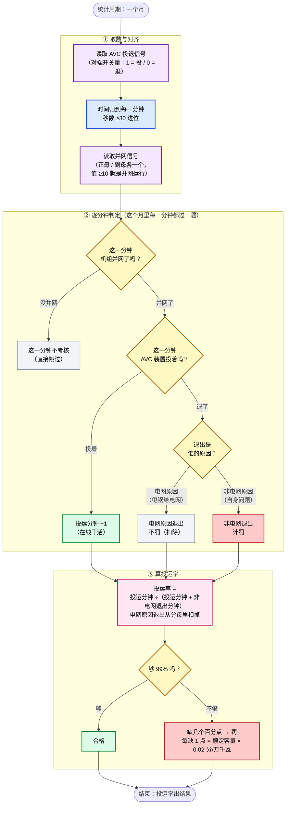
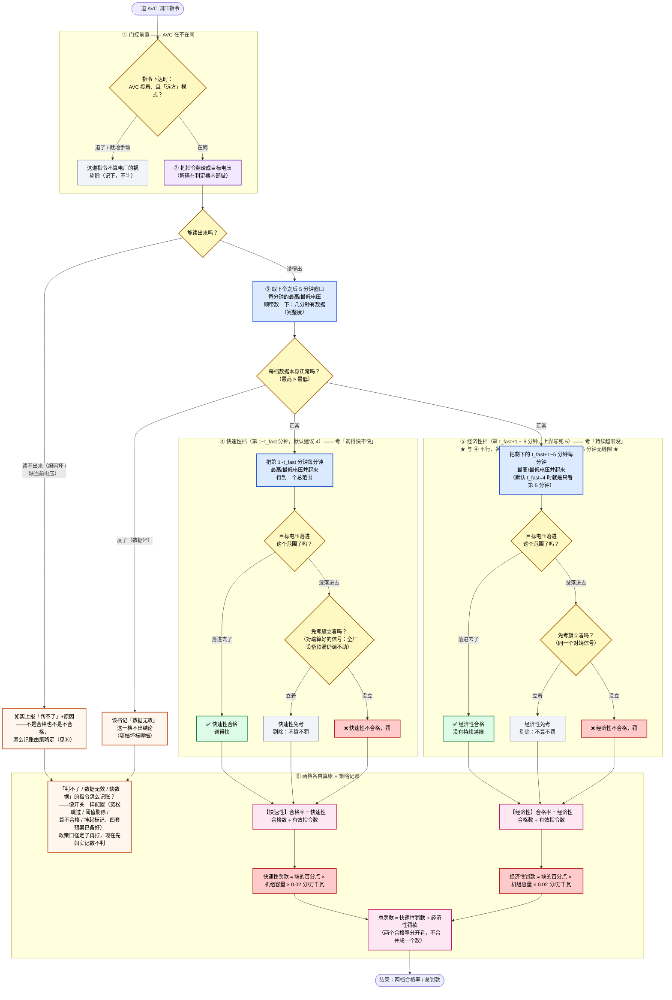

# VQMS AVC 考核核心算法 —— 流程图 v5.0（通俗版 · 给非开发同事看）

> 这张图用大白话讲两件事：**AVC 装置投运率**（它在不在线）和 **调节合格率**（下达指令后调到目标没）。
> 口径依据：[项目规划 v5.0](../项目规划_v5_0.md)。相对 [v4.0 通俗版](AVC考核核心算法_流程图_通俗版_v4_0.md)的主要变化见文末「这版定死了什么」。
>
> ⚠️ **先分清**：两个独立考核维度，不是同一个数。
> - **投运率**：考时间——AVC 装置这个月有没有在线干活，够不够 99%。
> - **调节合格率**：考动作——调度下一道调压指令，AVC 有没有在规定时间内把电压调到位。

---

## 总览：一道指令要过的三道岗（v5.0 新口径）

> 一句话：**先看 AVC 在不在岗 → 再看调到没调到 → 最后看该不该免责**。三道岗各管各的，互相不掺和。

**为什么这么拆**：在不在岗（门控）决定"这道指令判不判"；调没调到位（判定）只看电压事实；该不该免责（免考）是另一个系统算好的结论，我们只读取。三件事硬塞在一锅里判，规则一改整锅都得翻。

---

## 图 A：AVC 投运率是怎么算出来的（时间记账）

> 一句话：这个月里，只要机组并网着、AVC 装置也投着，就记「投运」；退了就记「退出」。退出分两种——电网原因导致的退出**不罚**（扣除），非电网原因的退出**计罚**。最后看投运时间够不够 99%。

📌 v4.0 版「还没定死的点」里问的**并网信号从哪来**、**退出原因能不能自动分**——这版都有答案了：都是对端系统算好的现成信号（并网 = 两条母线各一个「带电+机组数」打包值；退出原因 = 每条母线一个三态值：0 未退 / 1 电网原因 / 2 非电网），我们直接读结论，不用自己判。

---

## 图 B：调节合格率是怎么算出来的（三道岗 · 两档平行 · 策略记账）

> 一句话：调度下一道调压指令 → 先过**门控**（AVC 退了或电厂切「就地」手动模式的，不算电厂的锅）→ 过**判定**（解码出目标电压，**快速性档**和**经济性档**同时、各自独立地判「电压够到目标没」）→ 判了不合格的再看**免考旗**（对端系统算好的：全厂无功设备都顶满了还调不动 = 免责）。两档各算各的合格率和罚款，最后相加。
>
> 📌 **关键**：两档是**平行**的两个考核，不是「先短窗、没过再看长窗」。一条指令可能快速性档被罚（调得慢）、经济性档合格（最终还是调到位了）——两个结论互不影响，**连分母都各算各的：两档的「有效指令数」不是同一个数**（一条指令可能快速性档被免考剔除、经济性档照常计入分母，反之亦然——免考逐档剔除，互不牵连）。
>
> 📌 **窗口就 5 分钟，两档无缝拼接**：指令 5 分钟就来一条，判定窗口总共 5 分钟——**快速性档管第 1 ~ t_fast 分钟**（t_fast 可整定 1~4，默认建议 4），**经济性档管剩下的 t_fast+1 ~ 第 5 分钟**（上界 5 写死，下界跟着 t_fast 走；默认 t_fast=4 时就是只看第 5 分钟）。v4.0 图里"长窗口 5~30 分钟"的说法已作废。
>
> 📌 **常见疑问**：把 t_fast 调小（比如设成 2），中间那几分钟归谁管？——**归经济性档**：它的窗口自动变成第 3~5 分钟。不管 t_fast 整定成几，两档拼起来正好是完整的 5 分钟，**一分钟都不漏、也不重复**。

📌 **免考为什么是"看旗"**：判「全厂无功设备是不是都顶满了还调不动」需要每台设备的无功实测和极限曲线——这些数据和复杂计算都甩给对端系统做，它算好竖一面旗（全厂一个信号：1 = 免考）。我们只看旗，不自己判，**免考不是判定的第三种结果**，是给"判了不合格"的指令事后免责。

📌 **流水账兜底**：每道指令的原文都先原样抄进一个只增不改的账本（流水账）。哪怕将来解码规则变了（比如增量编码里有一位的含义现在还没定），拿着账本里的原文就能整体重新算——不会因为当时没读懂就永久丢数。

---

## 颜色含义

紫 = 取数 · 蓝 = 对齐 / 算区间 · 黄 = 判定关 · 绿 = 合格 · 红 = 不合格 / 罚 · 灰 = 不计 / 跳过 / 剔除 · 粉 = 汇总出结果 · **橙 = 「判不了 / 待策略」的诚实上报（v5.0 新增）**。

## 这版定死了什么（相比 v4.0 通俗版「还没定死的点」）

| v4.0 的疑问 | v5.0 的答案 |
|---|---|
| 退出原因从哪来、能否自动分 | ✅ 对端算好：每条母线一个三态值（0 未退 / 1 电网免责 / 2 非电网计罚），直接读 |
| 并网信号从哪来 | ✅ 对端算好：正/副母各一个「带电+机组数」打包值，≥10 即并网 |
| 长窗口多久算到头 | ✅ 定死：窗口总共 5 分钟（指令 5 分钟一条），两档**无缝拼接**——快速性档 [1, t_fast]（默认建议 4、可整定 1~4），经济性档 [t_fast+1, 5]（上界写死、下界随 t_fast）；不管整定成几都拼满 5 分钟、无空档 |
| 免考能否自动判 | ✅ 对端竖旗我们看旗（全厂一个信号），不需要设备级数据进本系统 |
| 窗口里某分钟没数据 | 🕐 四套处置预案已备好（宽松/阈值剔除/算不合格/挂起标记），**政策口径拍板后像改配置一样生效**；拍板前如实记数、不判 |

## 还没定死的点（留给现场 / 政策确认）

- **增量指令第 2 位「循环码」**：含义已明——**是 0~5 的循环码**（2026-08-19 确认），**不影响目标电压怎么算**（方向和幅值才参与计算，这一位只是编号性质的循环标记）。等真实数据到的只剩一件事：确认它的**轮转规律**（比如是不是每条指令转一格、用来防丢令），确认后解码规则就算完全定稿。
- **500kV 母线**：数据和点号都待现场补录（现在只有 220kV 两条母线）。
- **门控 / 投退信号的真实点号**：合成测试环境已跑通；真实现场部署后核对一遍再正式启用。
- **「判不了 / 缺数据」的记账策略**：即上表最后一行，等政策口径（不阻塞系统开发，先记账后处置）。
- **合格率的分母口径**：免考剔除法（图里画的「÷ 有效指令数」）还是附件6 原始口径（合格点数 ÷ 发令次数）——待业务确认；图按现行推荐口径画。另注：快速性、经济性两档的「有效指令数」**各自独立计算、不一定相等**（免考逐档剔除，一档剔除不影响另一档，2026-08-19 评审补注）。

> 详细技术口径见 [项目规划 v5.0](../项目规划_v5_0.md)（权威）与 [AVC考核核心算法_草稿v5_0.md](../AVC考核核心算法_草稿v5_0.md)（算法口径）。技术版流程图 v4.0 暂未随 v5.0 重绘，以规划文档为准。
