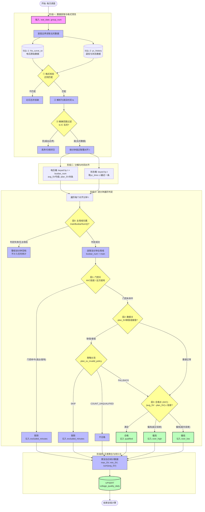

# VQMS 核心算法：分钟至日表 Rollup (预计算)

该流程图展示了从获取原始数据、时间格式清洗、分桶对齐，到层层过滤判定（主母线归属、门控、数据有效性、合格判定）的完整闭环。

## 算法分层说明 (对应 §5.7)

1. **层 0 (主母线归属)**: 在进入合格率计算前，必须先确定该分钟该组的主母线是哪一条。这一步是整个算法的**前置闸门**，避免将副母线的数据误计入考核。
2. **层 1 (门控关)**: 依据站级 YX 信号 (如远方/就地模式，AVC 投入/退出) 决定当分钟是否参与考核。如果不参与，则计入 `excluded_minutes`，不进入总考核时长分母。
3. **层 2 (数据关)**: 对基础数据质量进行控制，对于下发目标电压 (`plan_SV`) 异常或缺失的情况，提供策略配置，通常也会走向剔除 (`SKIP`)。
4. **层 3 (合格关)**: 实际的控制达标率判定，判断偏差是否在配置的容差 `tolerance_v` 内。

### 合格率与对账 (§5.6 / §5.7.1)

- 日：`qualification_rate = qualified / total × 100`，`total = qualified + over_high + over_low`
- `total + excluded = 该母线当天充当主母线的全部分钟` (excluded 只含层 1 与 层 2 剔除，**不含**层 0 跳过与组级空档)
- 月/年：`rate = SUM(qualified) / SUM(total) × 100` (**绝不直接 AVG rate 列**)；`avg_SV` 按 `total` 加权；`excluded = SUM(excluded)`
