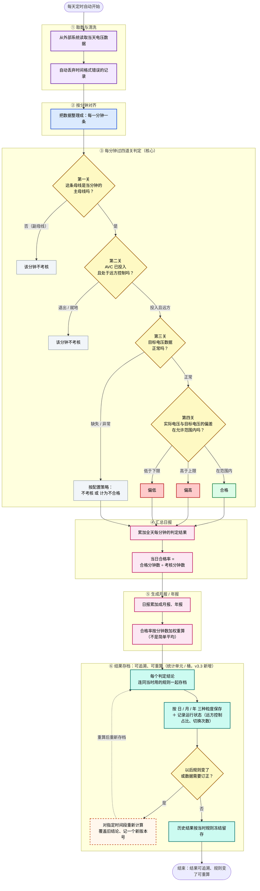

# 电压质量管理系统：电压合格率是怎么算出来的（通俗版 · 给非开发同事看）

> 这张图用大白话讲：每天的"电压合格率"是怎么从原始数据一步步算出来的，以及判定结果怎么存档、以后规则变了怎么重算。不涉及表名、字段名、代码，只讲业务逻辑。系统每天定时自动运行。

## 一句话总结

每一分钟，先确认"是不是该考核的主母线"、再确认"AVC 在不在管"、再确认"数据可不可用"，最后比一下"实际电压离目标多远"——在范围内就是合格，否则偏高或偏低。把全天每分钟的结果加起来，就是当天的合格率；再累加成月报、年报。

所有判定结论会**连同当时用的规则一起存档**（按 日 / 月 / 年 保存）：以后规则变了，历史结果仍按当时的规则留存、不被回溯改写；需要时还能对任意时间段**重新计算**，覆盖旧结论并记一个新版本号。

> 颜色含义：紫=取数，蓝=对齐，黄=判定关，绿=合格，红=不合格（偏高/偏低），灰=不考核，粉=汇总输出，青=结果存档（v3.3 新增），橙虚线=重新计算。
