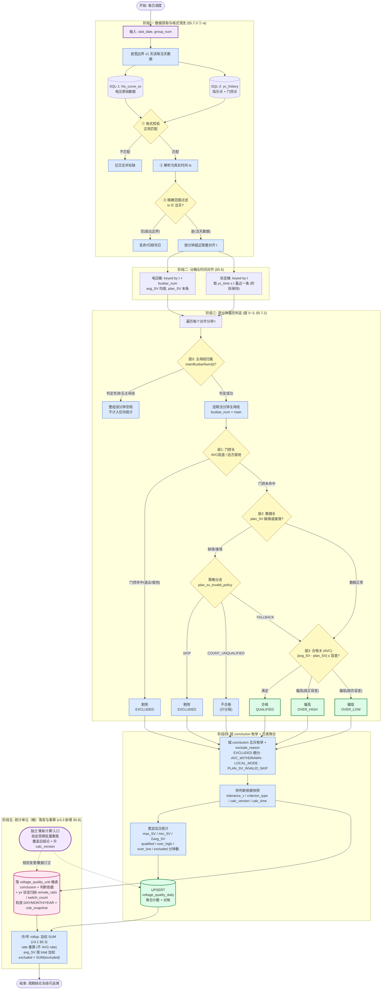

# VQMS 核心算法 v3.3：分钟至日表 Rollup + 判定结论落库（预计算）

该流程图展示 v3.3 的完整闭环：取数与格式清洗、分桶对齐、逐分钟层 0~3 判定、**赋 `conclusion` 枚举**，以及 **§5.8 新增的「统计单元（桶）」结论落库与重算**。判定算法（层 0~3）与 v3.2 一致；v3.3 只把循环里算出的结论持久化为可追溯、可重算的存储值。

> 与 v3.2 流程图的差异：阶段四改为"赋 conclusion 枚举 + 日表聚合"；新增**阶段五**——每个考核点的 `conclusion` + 判断依据（阈值快照 / `calc_version` / `rule_snapshot`）+ yx 状态归纳落 `voltage_quality_unit` 桶表，并提供独立"重新计算"入口。

## 阶段说明

1. **阶段一~三（同 v3.2）**：取数 → 格式清洗三步闸门 → 分桶对齐 → 逐分钟层 0（主母线归属）+ 层 1（门控）+ 层 2（数据）+ 层 3（合格）判定，终态 ∈ {合格, 偏高, 偏低, 剔除, 空档}。
2. **阶段四（v3.3 改写）**：每个考核点的终态赋 `conclusion` 互斥枚举（`QUALIFIED/OVER_HIGH/OVER_LOW/EXCLUDED`）+ `exclude_reason`，附判断依据快照（`tolerance_v`/`calc_version`）；同时累加聚合计数 UPSERT `voltage_quality_daily`。
3. **阶段五（v3.3 新增 §5.8）**：`conclusion` + 判断依据 + yx 状态归纳落 `voltage_quality_unit` 桶表（粒度 DAY/MONTH/YEAR），月/年加权 rollup；提供独立"重新计算"入口，规则变更/数据订正后按周期批量重跑、覆盖旧结论、升 `calc_version`——历史结论冻结可追溯，不随规则回溯改变。

> ⚠️ §5.8.3 待决（Q1~Q3）尚未定稿：`conclusion` × 粒度口径、与 `voltage_quality_*` 表关系（并存/取代/合并）、`plan_sv` 周期代表值与 MINUTE 粒度落库成本。定稿后本图阶段五可能微调。
