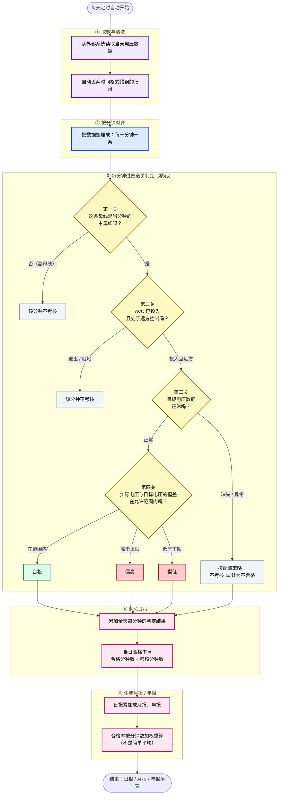

# VQMS 电压合格率是怎么算出来的（v3.4 通俗版 · 给非开发同事看）

> 这张图用大白话讲：每天的"电压合格率"是怎么从原始数据一步步算出来的。不涉及表名、字段名、代码，只讲业务逻辑。系统每天定时自动运行。
>
> ⚠️ **先分清两种"合格"**：这里的"合格"指 **AVC 控制达标**——实际电压落在调度下发的**目标窄区间**内（如 220kV 目标 ±300V）；**不是**国标 ±10% 那种宽松合规线（198~242kV）。两者数值差一个数量级，VQMS 当前按 AVC 口径统计。
>
> 📌 **v3.4 相对 v3.3 的唯一变化**：撤销了 v3.3 的"统计单元（桶）"存档设计——判定结论**算完即落聚合计数**（日报/月报/年报），不再单独存每分钟结论、无独立重算入口。判定算法（四道关）不变。本图即反映 v3.4 口径。

## 一句话总结

每一分钟，先确认"是不是该考核的主母线"、再确认"AVC 在不在管"、再确认"数据可不可用"，最后比一下"实际电压离目标多远"——落在目标窄区间内就是合格，否则偏高或偏低。把全天每分钟的结果加起来，就是当天的合格率（AVC 控制达标率）；再累加成月报、年报。

> 颜色含义：紫=取数，蓝=对齐，黄=判定关，绿=合格，红=不合格（偏高/偏低），灰=不考核，粉=汇总输出。
>
> 📌 与 v3.3 通俗版的区别：**去掉了第⑥阶段"结果存档（统计单元/桶）"**——v3.4 不再单独存每分钟结论，判定结果直接累加进日报/月报/年报，无独立重算入口（只能整体重跑）。
